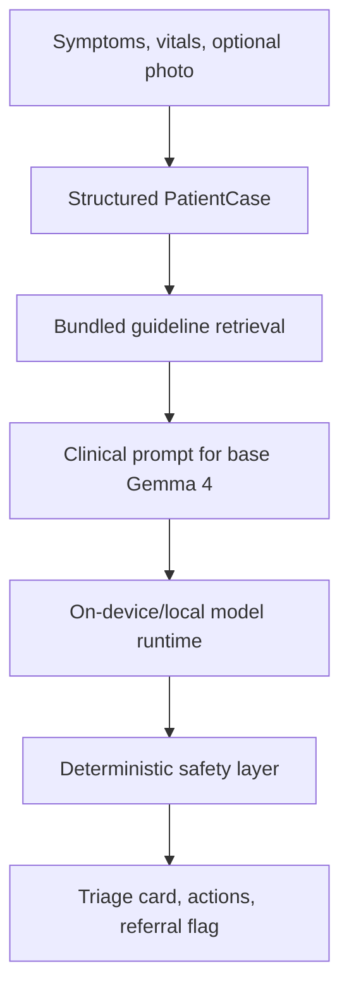

# VaidyaAI

VaidyaAI is a hackathon MVP for the Kaggle Gemma 4 Impact Challenge: an offline rural health diagnosis aide for community health workers in rural India.

The MVP strategy is **base Gemma 4 + local clinical RAG + deterministic safety rules**. Fine-tuning is intentionally optional: the app should work without an A100 training run, without cloud inference, and without internet once deployed.

The repository is split into four build areas:

- `app/`: Flutter mobile app with Hindi/English intake, local RAG, deterministic safety rules, and an Ollama/local runtime adapter.
- `training/`: optional A100-scale LoRA pipeline for medical SFT, multimodal alignment, and Hindi DPO.
- `rag/`: scripts to build a bundled SQLite knowledge base and optional MiniLM embeddings.
- `eval/`: benchmark harness for held-out MedQA/Hindi-style cases.

## Primary Architecture



Safety-critical logic is outside the model. Red flags escalate triage even if the model is uncertain, and prescription dosage text is stripped from actions.

## Quick Start

```sh
cd app
flutter pub get
flutter test
flutter run
```

## Optional Training Pipeline

The app does not require fine-tuning. These scripts are included for teams with A100/H100 access who want to improve the base model later. Kaggle T4/P100 is not enough for Gemma 4 E4B LoRA in the current stack.

```sh
python training/stage1_sft.py --output-dir checkpoints/stage1
python training/stage2_multimodal.py --stage1-checkpoint checkpoints/stage1 --output-dir checkpoints/stage2
python training/build_hindi_dataset.py --input data/medqa_sample.jsonl --output data/hindi_dpo.jsonl
python training/stage3_dpo_hindi.py --stage2-checkpoint checkpoints/stage2 --dataset data/hindi_dpo.jsonl --output-dir checkpoints/stage3
python training/export_gguf.py --model-path checkpoints/stage3 --output-path models/vaidya_e4b_q4.gguf
```

## RAG Pipeline

```sh
python rag/build_knowledge_base.py --input app/assets/rag/guideline_chunks.json --output app/assets/knowledge_base.sqlite
python rag/embed_chunks.py --db app/assets/knowledge_base.sqlite
```

## Evaluation

```sh
python eval/benchmark.py --predictions eval/predictions.jsonl --gold eval/gold.jsonl
```

## Safety Note

VaidyaAI is clinical decision support for non-doctor health workers, not a diagnosis device. The app escalates danger signs, avoids prescription dosages, and recommends PHC/doctor consultation when uncertain.
