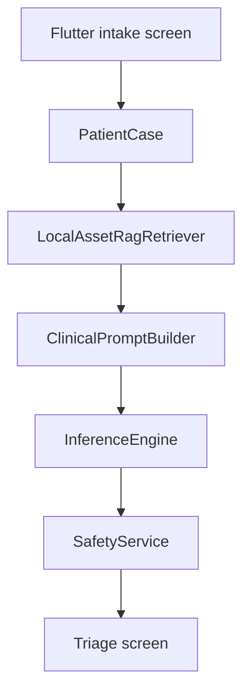

# VaidyaAI

VaidyaAI is an offline rural health triage aide for the Kaggle Gemma 4 Impact Challenge. The MVP is a Flutter Android-first app for community health workers in rural India: enter Hindi or English symptoms, add vitals, optionally attach a photo placeholder, and receive a conservative triage card in under five seconds.

## MVP Scope

- Hindi/English UI toggle for the CHW workflow.
- Structured symptoms and vitals intake.
- Photo and voice capture placeholders ready for mobile plugins.
- Local guideline retrieval from bundled assets in `assets/rag/`.
- Mock offline inference engine for reliable demos.
- Safety layer outside the model for red-flag escalation and dosage blocking.
- Ollama-compatible inference adapter boundary for local Gemma runtime integration.

## Architecture



The app keeps LLM output behind typed contracts. `MockInferenceEngine` powers the current demo, while `OllamaInferenceEngine` provides a local HTTP adapter for a future on-device Gemma 4 runtime.

## Run

```sh
flutter pub get
flutter test
flutter run
```

## Medical Safety

This project is clinical decision support for non-doctor health workers, not a diagnosis device. It does not provide prescription drug dosages, escalates red flags toward referral, and advises PHC or doctor consultation when uncertain.
